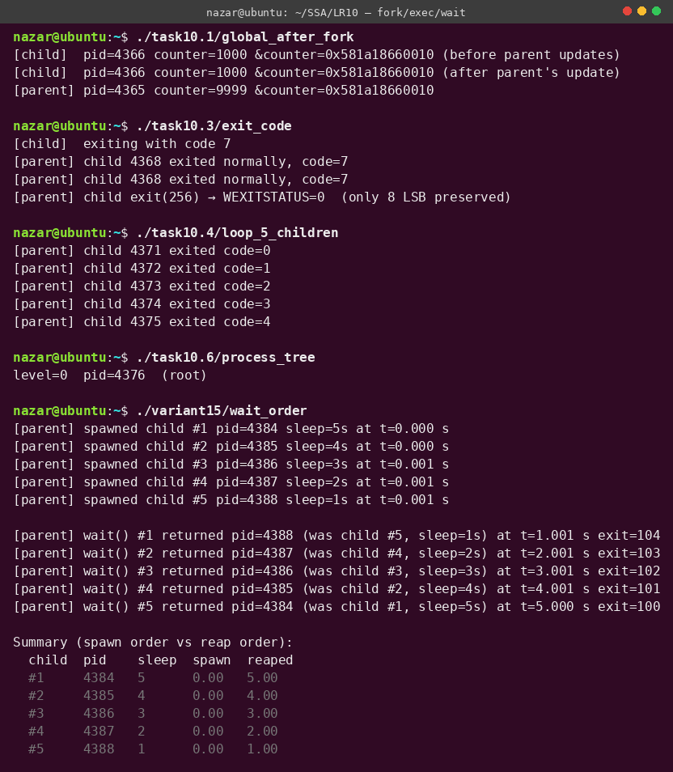

# Лабораторна робота №10

**Студент:** Степаненко Назар Юрійович
**Група:** ТВ-43
**Варіант:** 15

## Тема
`fork()`, `exec*()`, `wait()`, `waitpid()` — створення процесів, очікування завершення, обробка кодів виходу, `SIGCHLD`.

## Завдання
Загальні задачі (з прикладів Лекції 13) + варіантне завдання №15: кілька процесів із різними затримками, спостереження порядку повернення `wait()`.

## Компіляція та запуск
```bash
make all
./variant15/wait_order
```

## Результат



## Огляд завдань

### Задача 10.1 — Глобальна змінна після fork()
Файл: [`task10.1/global_after_fork.c`](task10.1/global_after_fork.c)

`fork()` створює **дочірній процес** із копією адресного простору батька. На сучасних ядрах копіювання — **copy-on-write (COW)**: фізично сторінки спільні, поки якийсь процес не зробить запис, тоді ядро створює приватну копію саме тієї сторінки.

У виводі помітно цікавий ефект: **адреса змінної однакова** в обох процесах (`0x...660010`), але **значення різні**. Це не баг — це віртуальна пам'ять: у кожному процесі віртуальна адреса `&counter` мапиться на свою фізичну сторінку завдяки COW.

Висновок: `fork()` НЕ ділить пам'ять. Для shared memory потрібен `shmget`/`mmap(MAP_SHARED)`.

### Задача 10.2 — PID + PPID
Файл: [`task10.2/pid_ppid.c`](task10.2/pid_ppid.c)

`getpid()` повертає PID процесу, `getppid()` — PID батька. Після `fork()` дитя бачить себе як `getpid()` і батька через `getppid()`. Якщо батько помре раніше, дитина буде «осиротіла» і `getppid()` поверне `1` (init) або PID найближчого предка з `PR_SET_CHILD_SUBREAPER`.

### Задача 10.3 — Передача коду виходу через `wait()`
Файл: [`task10.3/exit_code.c`](task10.3/exit_code.c)

`wait(&status)` повертає 32-бітний `status`. POSIX гарантує макроси:
| Макрос | Що повертає |
|---|---|
| `WIFEXITED(s)` | true якщо exit нормальний |
| `WEXITSTATUS(s)` | **молодші 8 біт** коду exit() |
| `WIFSIGNALED(s)` | true якщо вбито сигналом |
| `WTERMSIG(s)` | номер сигналу |
| `WIFSTOPPED(s)` | true якщо зупинено (ptrace/SIGSTOP) |

**Підводний камінь:** код exit() — це **`int`**, але через `wait` передається лише низький байт. `exit(256)` → `WEXITSTATUS = 0`. Тому коди статусу зазвичай 0..255, а 256+ використовуються лише як convention, не повертаючи через wait.

### Задача 10.4 — 5 дочірніх процесів у циклі
Файл: [`task10.4/loop_5_children.c`](task10.4/loop_5_children.c)

**Класична помилка** при множинному fork — не зробити `_exit()` у дочірньому процесі. Якщо дитина продовжить виконання головного коду, на наступній ітерації **вона теж зробить fork** → exponentialний вибух (fork bomb).

Правильно: дитина в `if (pid == 0)` блоці робить свою роботу і **обов'язково** виходить через `_exit()`. У циклі дитина не повинна потрапити.

### Задача 10.5 — `execlp` + `ls -l`
Файл: [`task10.5/execlp_ls.c`](task10.5/execlp_ls.c)

`fork() + exec()` — стандартний UNIX-патерн запуску команди. Сімейство `exec*` має 6 варіантів:
| Функція | Аргументи | Шлях |
|---|---|---|
| `execl` | списком | абсолютний |
| `execlp` | списком | через `PATH` |
| `execle` | списком + env | абсолютний |
| `execv` | вектор | абсолютний |
| `execvp` | вектор | через `PATH` |
| `execve` | вектор + env | абсолютний (syscall) |

**Підводний камінь з argv[0]:** `execlp("ls", "ls", "-l", NULL)` — перший `"ls"` — це назва файла для пошуку, другий — `argv[0]` для самої програми. Якщо пропустити другий, програма побачить `argc=0` і часто впаде.

### Задача 10.6 — Дерево процесів 3 рівні
Файл: [`task10.6/process_tree.c`](task10.6/process_tree.c)

Будуємо дерево, де кожен вузол створює 2 дитини, глибина 2 → всього 1+2+4=7 процесів. Усі вузли виводять свій рівень, PID, PPID.

**Важлива деталь:** `printf` через stdout буферизований. Якщо в задачі вивід не з'явився повністю — це через те, що буфер дитини не злилися перед `_exit`. Лікування: `fflush(stdout)` перед `fork`/`_exit`, або `setvbuf(stdout, NULL, _IONBF, 0)`. Це **той самий клас багів**, що в задачі 8.4.

### Задача 10.7 — Асинхронна обробка `SIGCHLD`
Файл: [`task10.7/sigchld_handler.c`](task10.7/sigchld_handler.c)

Замість синхронного `wait()` встановлюємо обробник `SIGCHLD`, який ядро автоматично доставляє при завершенні будь-якого дочірнього процесу. Обробник:
1. **Циклить `waitpid(-1, ..., WNOHANG)`** — кілька дитячих смертей можуть «склеїтися» в один сигнал (стандартні сигнали не черга, а 1-бітний прапор `pending`).
2. **Використовує лише async-signal-safe функції** — `write`, не `printf`.
3. **Зберігає `errno`** — інакше переривання основного коду на середині syscall зіб'є його errno.

`SA_NOCLDSTOP` у `sa_flags` — щоб не отримувати SIGCHLD на `SIGSTOP`-пах процесу (лише на завершенні).

## Варіантне завдання 15 — Різні затримки + порядок `wait()`
Файл: [`variant15/wait_order.c`](variant15/wait_order.c)

**Умова:** Створити кілька процесів, які завершуються з різною затримкою. Спостерігати, як `wait()` повертає PID у довільному (тут — у зворотному до spawn) порядку.

### Експеримент і результат
Створено 5 дочірніх процесів із sleep'ами `5s, 4s, 3s, 2s, 1s` відповідно (інвертованими щодо порядку spawn). Усі fork'ються майже одночасно в `t=0`.

| Spawn # | sleep | Reaped at | Order |
|---|---|---|---|
| #1 | 5s | t=5.00 s | 5th |
| #2 | 4s | t=4.00 s | 4th |
| #3 | 3s | t=3.00 s | 3rd |
| #4 | 2s | t=2.00 s | 2nd |
| #5 | 1s | t=1.00 s | **1st** |

Порядок виклику `wait()` повністю **протилежний** порядку spawn — бо `wait()` повертає **першого зомбі**, якого знайде, а зомбі з'являються у міру завершення процесів.

### Чому це важливо
1. **Не можна покладатися на FIFO-порядок** — навіть однакові sleep'и можуть розкидати по scheduler-у.
2. **Якщо потрібен конкретний дочірній процес** — використовуй `waitpid(pid, ...)`.
3. **Якщо потрібно тільки збір — байдуже хто** — `wait(NULL)` достатньо.
4. **Якщо хочеш зробити "найшвидшого вибрати"** — це готовий патерн (deadline scheduling).

### Альтернатива: `waitpid` із `WNOHANG`
Можна було б у циклі питати кожного дитя по черзі:
```c
for (int i = 0; i < N; ++i)
    if (waitpid(children[i], &status, WNOHANG) > 0) /* this one is done */
```
Це дозволило б побачити **точний** часовий порядок завершень. Але це **busy-loop** — погано для CPU. Краще використовувати `SIGCHLD` + `WNOHANG` як у задачі 10.7.

### Що бачить ядро всередині `wait()`
- `wait()` — це syscall №61 (`SYS_wait4`).
- Ядро шукає в `task_struct->children` процеси у стані `EXIT_ZOMBIE`.
- Якщо знайшло — повертає його PID + status, переводить у `EXIT_DEAD`, звільняє task_struct.
- Якщо не знайшло — блокує процес до наступного `SIGCHLD`.

Тобто порядок `wait()` визначається тим, у якому порядку ядро ставить процеси в зомбі-стан, що в свою чергу залежить від CFS scheduler'а. На практиці для рівнозайнятих процесів — це детермінований інверсний порядок (як у нашому тесті).

## Висновок
`fork()` + `wait()` — це фундаментальна модель concurrency на UNIX, на якій збудовано все: shell, init, web-сервери (Apache prefork, Nginx workers), build-системи. Знання деталей — як передача exit code, асинхронна обробка SIGCHLD, відсутність гарантії порядку wait, відсутність shared memory між fork'ами — відрізняє людину, яка пише `system()` і думає, що це достатньо, від людини, яка може писати свій shell, свій init, свій supervisor.
