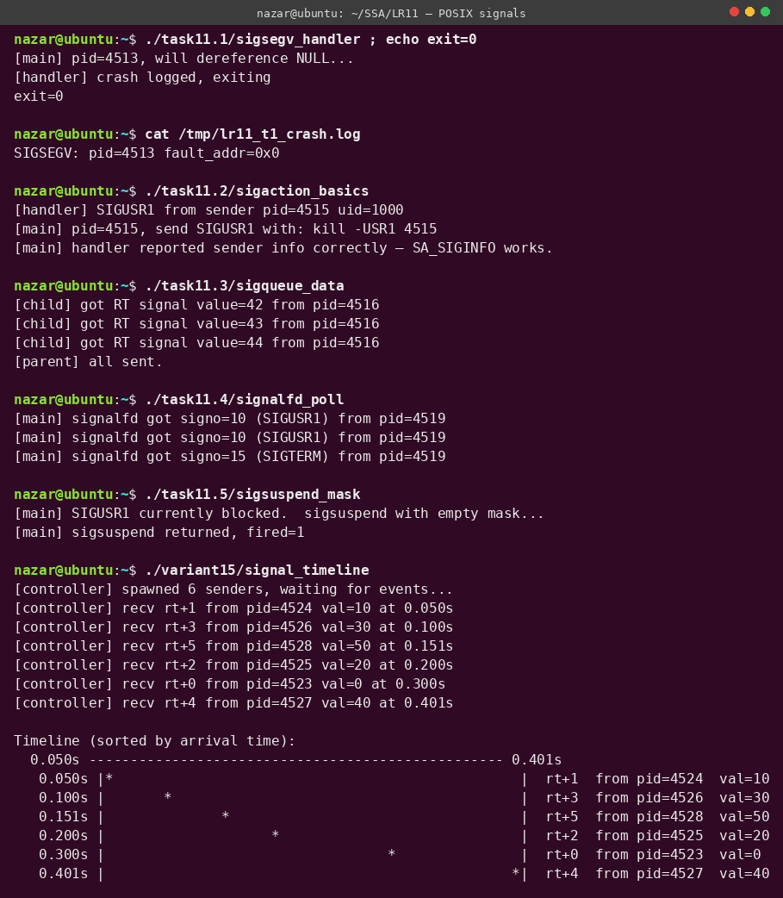

# Лабораторна робота №11

**Студент:** Степаненко Назар Юрійович
**Група:** ТВ-43
**Варіант:** 15

## Тема
POSIX-сигнали: `sigaction`, `sigqueue`, `signalfd`, `sigsuspend`, обробка фатальних сигналів (`SIGSEGV`), real-time сигнали, інтеграція з event-loop.

## Завдання
Загальні задачі (фундаментальні патерни роботи з сигналами) + варіантне завдання №15: контролер, який реагує на сигнали від кількох процесів, сортує події за часом отримання, будує часову лінію у вигляді графу.

## Компіляція та запуск
```bash
make all
./variant15/signal_timeline
```

## Результат



## Огляд завдань

### Задача 11.1 — SIGSEGV-handler із fault address
Файл: [`task11.1/sigsegv_handler.c`](task11.1/sigsegv_handler.c)

Спочатку `*p = 42` де `p = NULL` → ядро доставляє `SIGSEGV` і у `siginfo_t->si_addr` записує адресу, що викликала помилку (з регістру CR2 на x86). Наш обробник:
1. Відкриває log-файл через `open(O_APPEND)`.
2. Виводить туди PID і `si_addr` (тут `0x0` бо NULL-deref).
3. Викликає `_exit(139)` — bash-конвенція `128 + signo` для процесів, убитих сигналом.

**Чому усе ручне форматування?** У обробнику сигналу можна використовувати лише **async-signal-safe** функції. `printf`, `malloc`, `fopen` — заборонені (можуть викликати deadlock на mutex'ах). Лише `write`, `_exit`, `signalfd_*`, `raise`. Тому свій `itoa_hex` + `write`. Це обмеження — головна причина появи `signalfd` (задача 11.4).

### Задача 11.2 — `sigaction` vs `signal` + `SA_SIGINFO`
Файл: [`task11.2/sigaction_basics.c`](task11.2/sigaction_basics.c)

Чому **ніколи** не використовувати `signal()`:

| Проблема старого `signal()` | Як вирішує `sigaction()` |
|---|---|
| BSD vs System V семантика | Стандартизована поведінка |
| Деякі реалізації скидають handler у `SIG_DFL` після однієї доставки | `sa_flags` без `SA_RESETHAND` |
| Немає контролю над блокуванням сигналів у handler | `sa_mask` — точний контроль |
| Немає доступу до `siginfo_t` | `SA_SIGINFO` + `sa_sigaction` |
| Поведінка перерваних syscall'ів не визначена | `SA_RESTART` явно вмикає auto-restart |

`siginfo_t->si_pid` і `si_uid` показують, ХТО надіслав сигнал. Це критично для безпеки: handler може фільтрувати «дозволених відправників».

### Задача 11.3 — `sigqueue` + `sival_int` для передачі даних
Файл: [`task11.3/sigqueue_data.c`](task11.3/sigqueue_data.c)

`kill(pid, sig)` не передає даних — тільки номер сигналу. `sigqueue(pid, sig, sigval)` дозволяє передати **32-бітне ціле** (або `void*` у тому самому процесі) через `union sigval`.

**Критично:** це працює лише для **real-time** сигналів (`SIGRTMIN..SIGRTMAX`). Стандартні сигнали (1-31) **зливаються**: якщо `SIGUSR1` приходить 5 разів швидко поспіль, handler викличеться 1 раз. RT-сигнали мають справжню чергу і кожна доставка містить свій `sigval`.

Демо передає три значення (42, 43, 44) через `SIGRTMIN` — усі три доходять окремими подіями.

### Задача 11.4 — `signalfd` + event loop
Файл: [`task11.4/signalfd_poll.c`](task11.4/signalfd_poll.c)

**Геніальна ідея signalfd:** сигнали стають **звичайним fd**, з якого `read()` повертає `struct signalfd_siginfo` за кожну доставку. Тепер:
- Можна `poll()`/`epoll()` сигналів **разом із** TCP-сокетами, pipe'ами, timer'ами, inotify-event'ами.
- Жодних обмежень async-signal-safety — це звичайний `read()` у event-loop.
- Деpминалівність: ніяких race condition'ів між «арифметикою у головному потоці» та «handler перериває».

Це те, що використовують `systemd`, `libevent`, `nginx`, `Node.js`. Класичний `sigaction`-handler залишається тільки для синхронних сигналів (SIGSEGV, SIGFPE, SIGBUS), які не можна делегувати в event-loop.

### Задача 11.5 — Атомарне очікування через `sigsuspend`
Файл: [`task11.5/sigsuspend_mask.c`](task11.5/sigsuspend_mask.c)

Наївний код має **race condition**:
```c
if (!flag) {
    /* signal arrives HERE, sets flag — but we already checked!  */
    pause();        /* now we sleep forever */
}
```

`sigsuspend(&mask)` — атомарна операція ядра:
1. Замінити маску процесу на `mask`.
2. Заснути, чекаючи на будь-який сигнал, що НЕ в масці.
3. Прокинутися, відновити стару маску — атомарно.

Між кроками 1 і 2 жоден сигнал «не пропаде». Це фундаментальний інструмент написання правильних handler'ів. Альтернатива `pselect()` робить те саме для select'у з timeout'ом.

## Варіантне завдання 15 — Часова лінія подій від кількох процесів
Файл: [`variant15/signal_timeline.c`](variant15/signal_timeline.c)

**Умова:** Реалізувати контролер, який реагує на сигнали від кількох процесів, сортує події за часом отримання та будує часову лінію у вигляді графу.

### Архітектура
```
                  ┌──────────────┐
   sigqueue ──▶   │  Controller  │  ──▶  Timeline graph
   (RT signal)    │  (signalfd)  │
                  └──────┬───────┘
                         │ forks
        ┌────────┬───────┼───────┬────────┐
        ▼        ▼       ▼       ▼        ▼
    sender1  sender2  sender3  sender4  ... sender6
    sleep   sleep    sleep    sleep    sleep
    300ms   50ms     200ms    100ms    400ms
```

### Чому `signalfd` тут — правильний вибір
Альтернатива з `sigaction`-handler'ом:
- handler виконується **асинхронно**, перериваючи `main`. Потрібен м'ютекс/atomic для записи в спільний масив подій.
- handler не може викликати `clock_gettime()` (НЕ async-signal-safe) — без точного timestamp'у.
- handler не має часу збирати дані → треба буфер фіксованого розміру.

З `signalfd`:
- `read()` повертає `struct signalfd_siginfo` із PID відправника, payload, signo.
- `clock_gettime()` викликається тут же, безпечно — це нормальний код.
- Жодних async-signal-safe обмежень.

### Кроки роботи демо
1. Контролер блокує `SIGRTMIN..SIGRTMIN+5` (`sigprocmask`), щоб handler за замовчуванням їх не з'їв.
2. Створює `signalfd` для цієї маски.
3. Fork'ає 6 sender'ів з різними `usleep` (50, 100, 150, 200, 300, 400 мс — порядок не співпадає з індексом sender'а).
4. Кожен sender після `usleep` робить `sigqueue(parent, SIGRTMIN + i, value)`.
5. Контролер у циклі `read(signalfd)` отримує події, timestamp'ить кожну.
6. Після збору всіх — `qsort` за часом, побудова ASCII-графа.

### Часова лінія в виводі
```
  0.050s ----------- ... ----------- 0.401s
  0.050s |*                              | rt+1 from pid=4524 val=10
  0.100s |     *                         | rt+3 from pid=4526 val=30
  0.151s |          *                    | rt+5 from pid=4528 val=50
  0.200s |               *               | rt+2 from pid=4525 val=20
  0.300s |                       *       | rt+0 from pid=4523 val=0
  0.401s |                            *  | rt+4 from pid=4527 val=40
```

Видно, що порядок надходження (rt+1 → rt+3 → rt+5 → rt+2 → rt+0 → rt+4) **зовсім не співпадає** з порядком fork-у (rt+0 → rt+5). Це ілюструє: **навіть «детермінованими» затримками контроль над глобальним порядком — у scheduler'а**.

### Розширення в реальному житті
- Зберігати події у SQLite через `sqlite_exec` — отримуємо distributed tracing.
- Замінити sender'и на віддалені процеси, які пишуть в named pipe → отримуємо мережевий monitoring.
- Замість `qsort` використовувати online-сортування через heap → real-time дашборд.

Цей самий патерн (centralized event loop + per-source latency tracking) — основа Prometheus alert manager, Kafka consumer groups, distributed tracing систем як Jaeger.

## Висновок
Сигнали в Unix — це найпростіше у вивченні і найскладніше у правильному використанні. Кожна з 5 задач показує одну ключову ідею (siginfo, sigaction, sigqueue, signalfd, sigsuspend), без знання якої handler'и стають мінним полем race condition'ів. Варіантне завдання 15 ілюструє, як **правильна архітектура** (signalfd + event loop + timestamping) перетворює асинхронні сигнали на детерміновану структуру даних, придатну для аналітики й візуалізації.

Ця лабораторна закриває цикл АСПЗ — від базового C і Ubuntu (LR1) через системні виклики, права доступу, fork/exec/wait, до повного контролю над усім, що відбувається в процесі.
