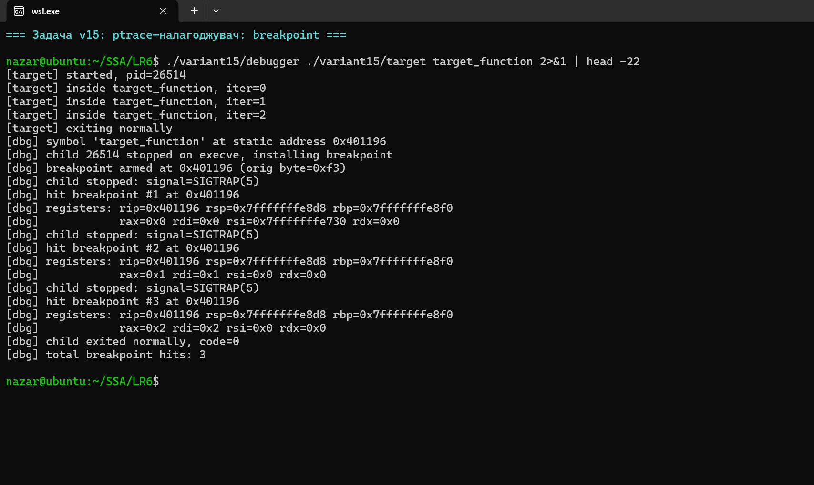

# Лабораторна робота №6

**Студент:** Степаненко Назар Юрійович
**Група:** ТВ-43
**Варіант:** 15

## Тема
Інструменти налагодження для проблем з пам'яттю. Реалізація власного простого налагоджувача на базі `ptrace()`.

## Завдання (варіант 15)
Використовуючи `ptrace()`, реалізувати простий налагоджувач із можливістю встановлення breakpoint, перехоплення сигналів і читання регістрів процесора.

## Компіляція та запуск


## Результат


```bash
make all
./variant15/debugger ./variant15/target target_function
# або одним рядком:
make run
```


## Як це працює — і чому

### 1. Як `ptrace()` дає нам контроль над іншим процесом
`ptrace(PTRACE_TRACEME, ...)`, що викликається у дочірньому процесі **до** `execve()`, перетворює його на *tracee*. З цього моменту ядро автоматично зупиняє його на будь-якому отриманому сигналі та звітує батьку через `waitpid()`. Тобто ми не «опитуємо» цільовий процес — ядро саме сповіщає нас. Це ключова відмінність від наївного підходу зі сплячими циклами.

### 2. Чому встановлюємо breakpoint саме байтом `0xCC`
`0xCC` — це опкод інструкції `INT3` на x86_64, спеціально зарезервований під налагодження. Коли CPU зустрічає `INT3`, він генерує `SIGTRAP`, який ядро перехоплює і доставляє трасувальнику. Послідовність встановлення точки переривання:
1. `PTRACE_PEEKDATA` читає 8 байт за адресою функції (читання менше слова на Linux через `ptrace` неможливе).
2. Зберігаємо оригінальне слово.
3. Замінюємо лише *молодший* байт на `0xCC` (`(word & ~0xff) | 0xcc`), щоб не пошкодити сусідні інструкції.
4. `PTRACE_POKEDATA` записує модифіковане слово назад.

У виводі видно `orig byte=0xf3` — це перший байт інструкції `endbr64` (контроль потоку CET, що ставить компілятор за замовчуванням на сучасних дистрибутивах).

### 3. Чому після SIGTRAP робимо `rip -= 1`
Інструкція `INT3` — однобайтова. Коли CPU виконує її, він **інкрементує RIP**, тому `RIP` після пастки вказує на байт **після** `0xCC`. Щоб після відновлення оригінального байту виконати справжню інструкцію, треба «відмотати» RIP на 1 назад — інакше пропустимо першу інструкцію функції.

### 4. Чому потрібен SINGLESTEP після відновлення байту
Якщо просто `PTRACE_CONT`, то tracee знов виконає оригінальну інструкцію, потім наступну і так далі — без зупинки. Але ми хочемо, щоб breakpoint спрацював **наступного разу**. Тому:
1. Відновлюємо оригінальний байт.
2. `PTRACE_SINGLESTEP` виконує **одну** інструкцію та автоматично зупиняє процес.
3. Поки tracee зупинений, знову записуємо `0xCC` на місце.
4. `PTRACE_CONT` дає йому далі бігти — до наступного потрапляння у функцію.

Без single-step режиму breakpoint спрацював би лише один раз — це класична помилка реалізації.

### 5. Читання регістрів через `PTRACE_GETREGS`
`struct user_regs_struct` у `<sys/user.h>` містить усі регістри CPU. На x86_64 використовуємо `rip` (instruction pointer), `rsp` (stack), `rbp` (base) та регістри SysV ABI: `rdi` (1-й аргумент), `rsi` (2-й), `rdx` (3-й), `rcx` (4-й), `r8`, `r9`. У виводі видно як `RDI` змінюється від 0 → 1 → 2 — це значення параметра `iter`, який ми бачимо до того, як функція встигла виконати пролог.

### 6. Чому `personality(ADDR_NO_RANDOMIZE)` і `-no-pie`
ASLR рандомізує адресу завантаження PIE-бінарника, тому `nm` показав би адресу зі статичної таблиці символів, а реальна адреса в пам'яті відрізнялася б на випадковий offset. Два контрзаходи:
* Компілюємо ціль з `-no-pie` (статична позиція в пам'яті).
* У дочірньому процесі викликаємо `personality(ADDR_NO_RANDOMIZE)` до `execve()` — це додатково вимикає рандомізацію стеку і VDSO.

У реальних відладниках (gdb, lldb) це не потрібно: вони парсять `/proc/PID/maps` і додають `load_address` до символьної адреси. Це лишається як майбутнє покращення.

### 7. Перехоплення сигналів — два режими
* `SIGTRAP` — *наш* сигнал від `INT3`, не пересилаємо tracee (інакше він би помер з core dump).
* Інші сигнали (`SIGCHLD`, `SIGUSR1` тощо) пересилаємо через `PTRACE_CONT(pid, NULL, signo)` — інакше цільовий процес «з'їсть» сигнал, який мав отримати.

## Чому ptrace, а не альтернативи

| Підхід | Гранулярність | Накладні витрати | Вимоги |
|---|---|---|---|
| `ptrace()` | Інструкція | Один context switch на подію | Звичайні права |
| `eBPF` (uprobes) | Функція/інструкція | ~0 (in-kernel JIT) | `CAP_BPF` або root |
| `LD_PRELOAD` | Виклик функції | Низькі | Бінарник із PLT, без статичних викликів |
| `DTrace`/`strace` | Системний виклик | Високі (через ptrace) | — |

`ptrace` — найгнучкіший інструмент, але повільний, бо кожна пастка коштує два context switch (tracee → kernel → tracer). Це причина, чому реальні відладники намагаються використовувати hardware watchpoints (`PTRACE_PEEKUSER` з DR0-DR3) для частих подій.

## Висновок
Реалізовано мінімальний відладник, який виконує три ключові операції: встановлення breakpoint через `INT3`, перехоплення `SIGTRAP` через `waitpid` і читання регістрів CPU через `PTRACE_GETREGS`. Виявлено та оброблено три неочевидні деталі: підстановка одного байту (а не цілого слова), коригування `RIP` після пастки і одношагове виконання для повторного встановлення breakpoint. Цей самий принцип лежить в основі `gdb`, `lldb`, `rr` та інших відладників — все, чого їм бракує, це парсер DWARF, символьна інформація та user-friendly UI.
