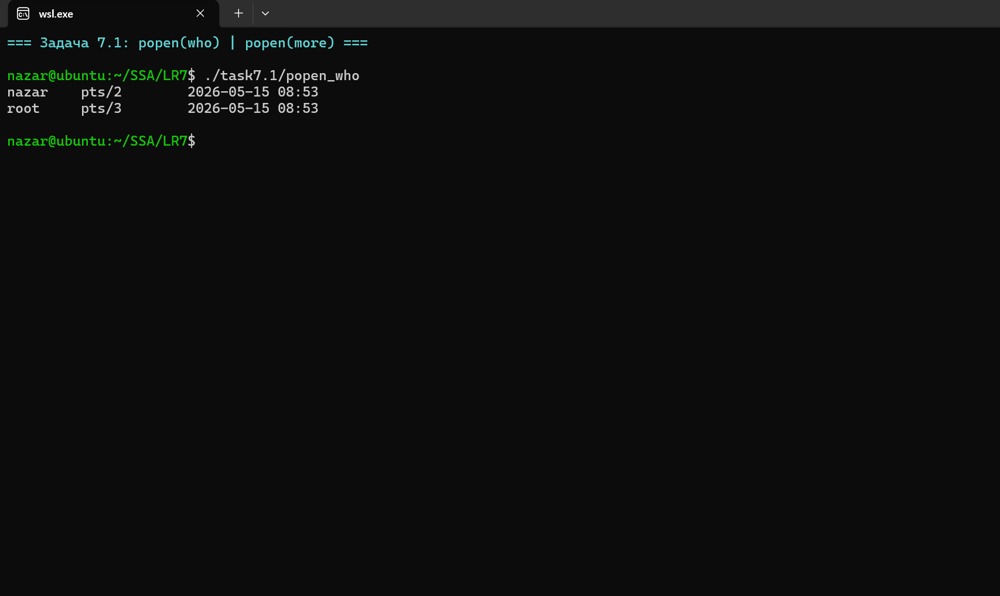
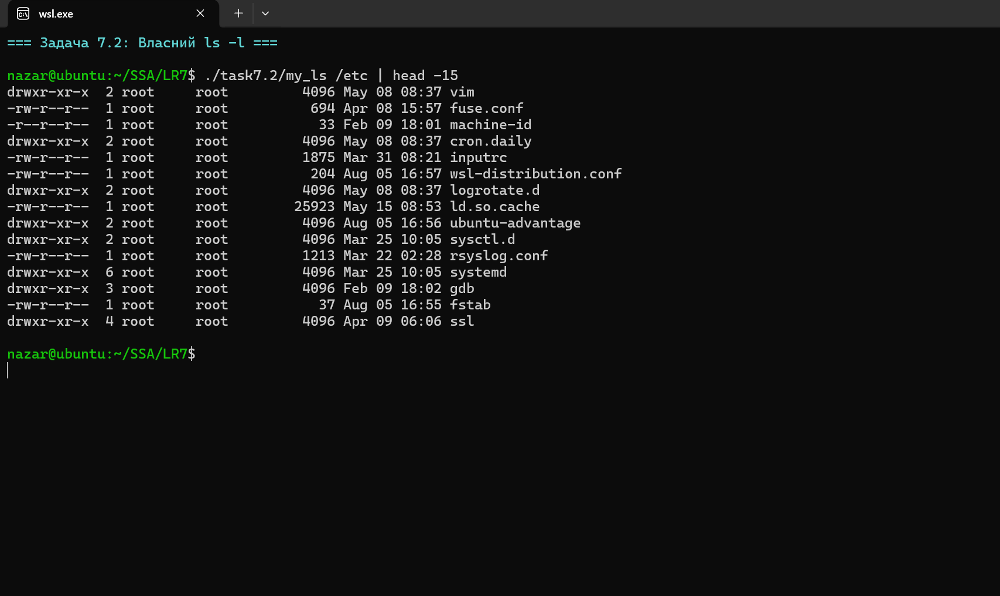
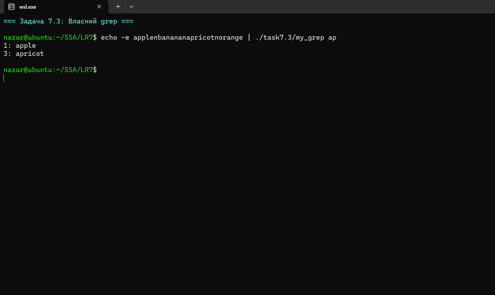
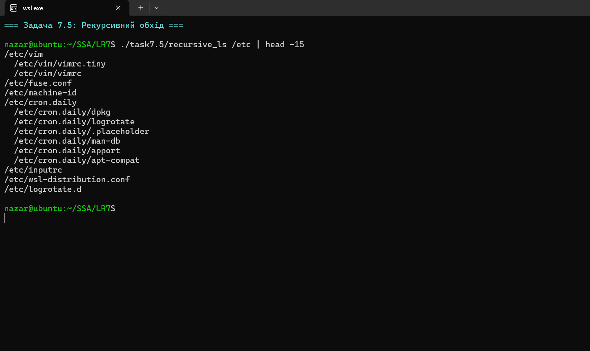
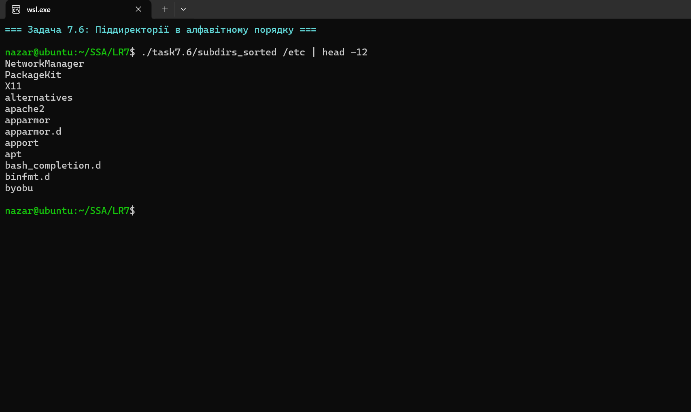
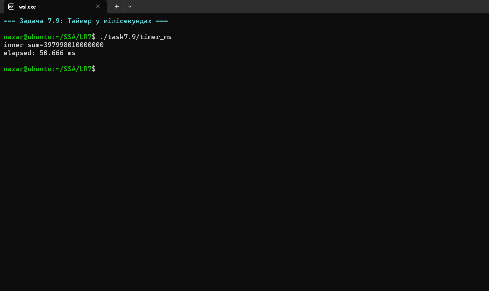
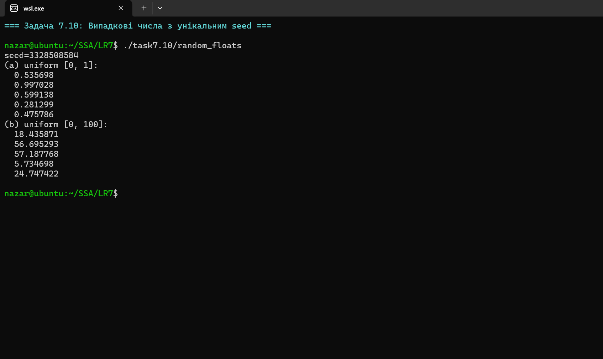
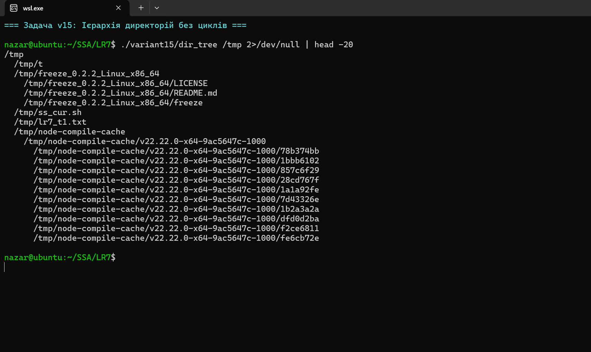

# Лабораторна робота №7

**Студент:** Степаненко Назар Юрійович
**Група:** ТВ-43
**Варіант:** 15

## Тема
Дослідження, моделювання та нестандартні підходи до аналізу процесів, файлових систем, безпеки та ресурсів в Linux.

## Завдання
Реалізовано 10 загальних задач + варіантне завдання №15: побудова ієрархії директорій із поточної точки, з виключенням циклічних посилань і збереженням символьних.

## Компіляція та запуск

```bash
make all
./task7.2/my_ls /etc
./variant15/dir_tree ~
```


## Огляд завдань

### Задача 7.1 — `popen("who") | popen("more")`


Файл: [`task7.1/popen_who.c`](task7.1/popen_who.c)
Замість оригінального `rwho` (службу `rwhod` майже ніде не вмикають) використано `who`. Ключова деталь: `popen` з режимом `"r"` повертає `FILE*` на stdout дочірнього процесу, а з режимом `"w"` — на його stdin. Це двосторонній pipe без `fork`/`pipe`/`dup2` руками. Запускати через `system("who | more")` забороняється — це б призвело до додаткового `/bin/sh` між нами і командами.

### Задача 7.2 — мій `ls -l` з нуля


Файл: [`task7.2/my_ls.c`](task7.2/my_ls.c)
Заборонено викликати `/bin/ls`. Тому використано: `opendir/readdir/lstat` для обходу + ручне форматування mode-бітів (`S_IRUSR`, `S_IWUSR`...), `getpwuid()` для імені користувача, `getgrgid()` для групи, `strftime()` для часу. Чому `lstat`, а не `stat`? `stat` слідує за symlink — він би повернув атрибути цілі, і ми б не змогли надрукувати `l` у першій колонці.

### Задача 7.3 — мій `grep`


Файл: [`task7.3/my_grep.c`](task7.3/my_grep.c)
Простий пошук підрядка через `strstr`. Реальний `grep` будує DFA з регулярного виразу для O(n) пошуку. Тут — наївний O(n·m), але цього достатньо для звичайних запитів. Введення через stdin або файл.

### Задача 7.4 — мій `more`
Файл: [`task7.4/my_more.c`](task7.4/my_more.c)
Цікавий момент: коли наш `more` сам стає правим кінцем pipe (`some_cmd | my_more`), `stdin` вже зайнятий даними з лівого кінця. Тому для запиту натискання клавіші читаємо **з `/dev/tty`** напряму — це завжди керуючий термінал процесу.

### Задача 7.5 — рекурсивний обхід


Файл: [`task7.5/recursive_ls.c`](task7.5/recursive_ls.c)
Використано `lstat`, тому симлінки **не** розкручуються — інакше симлінк сам-на-себе призвів би до StackOverflow. Це фундаментальна різниця між `lstat` і `stat` для будь-яких рекурсивних утиліт.

### Задача 7.6 — піддиректорії в алфавітному порядку


Файл: [`task7.6/subdirs_sorted.c`](task7.6/subdirs_sorted.c)
Замість ручного сортування — `scandir(".", &names, filter, alphasort)`. `scandir` робить два діла: збирає всі імена і сортує функцією-компаратором. Стандартний `alphasort` робить лексикографічне порівняння. Фільтр `dir_only` спочатку перевіряє `d_type` (швидко), а якщо ФС повернула `DT_UNKNOWN` (буває на старих ext або NFS) — падає на `lstat` як fallback.

### Задача 7.7 — надання прав на читання
Файл: [`task7.7/grant_read.c`](task7.7/grant_read.c)
Програма обходить `*.c`, перевіряє `S_IROTH` і пропонує дати read-доступ через `chmod(path, mode | S_IROTH)`. Важливо: `chmod` приймає **повний** новий режим, а не дельту, тому використовуємо OR з існуючим `st.st_mode`. Інакше ми б зняли всі інші біти.

### Задача 7.8 — інтерактивне видалення
Файл: [`task7.8/delete_prompt.c`](task7.8/delete_prompt.c)
`unlink()` видаляє запис у директорії. Якщо інших жорстких посилань немає і ніхто не тримає файл відкритим — індод звільняється. Якщо тримає (інший процес), файл буде «привидом» до `close()` — це класична причина, чому `df` показує менше вільного місця, ніж `du`. Тут програма це не демонструє, але такий ефект варто знати.

### Задача 7.9 — таймер у мілісекундах


Файл: [`task7.9/timer_ms.c`](task7.9/timer_ms.c)
Використано `clock_gettime(CLOCK_MONOTONIC)`, а не `clock()` чи `time()`. Чому:
* `clock()` міряє CPU-час → багатопоточність дає завищені значення, ідіотливо великі.
* `time()` має точність 1 секунда — для мс не годиться.
* `CLOCK_REALTIME` може стрибнути назад при NTP-синхронізації — для бенчмарків це катастрофа.
* `CLOCK_MONOTONIC` гарантовано не відкочується назад і має наносекундну роздільну здатність.

### Задача 7.10 — випадкові числа з унікальним seed


Файл: [`task7.10/random_floats.c`](task7.10/random_floats.c)
`srand(time(NULL))` — поширена помилка: якщо запустити програму двічі за одну секунду, отримаємо однакову послідовність. Тут seed змішаний з трьох джерел:
```
seed = ts.tv_nsec  XOR  (ts.tv_sec << 16)  XOR  (pid * 2654435761)
```
де `2654435761` — Knuth's multiplicative hash constant. Це достатньо для лабораторних — для криптографії потрібен `/dev/urandom` або `getrandom()`.

## Варіантне завдання 15 — ієрархія директорій без циклів
Файл: [`variant15/dir_tree.c`](variant15/dir_tree.c)

**Умова:** побудувати ієрархію директорій від кореня, **виключаючи циклічні посилання, але зберігаючи символьні**.

### Як працює виявлення циклів
Найважче — відрізнити «правильний» symlink від циклу. Простий підхід "не слідувати за жодним symlink" втрачає корисну інформацію: symlink на сусідню директорію — це не цикл.

Реалізовано двофазний підхід:
1. **Symlinks завжди обробляються через `lstat`** — ми бачимо їх як symlink, не як ціль. Друкуємо у форматі `path -> target` через `readlink()`. Не рекурсуємо в них автоматично.
2. **Справжні директорії перевіряються на dev/ino-цикл.** Перед входом у директорію ми додаємо її пару `(st.st_dev, st.st_ino)` в стек. При вході в наступну директорію перевіряємо: чи цей `(dev, ino)` вже в стеку? Якщо так — це цикл (наприклад, через bind-mount). Виводимо `[cycle ignored]` і не входимо.

Чому саме `(dev, ino)`, а не повний шлях? Бо bind-mount чи `mount --rbind` робить ту саму директорію видимою з різних шляхів, але `(dev, ino)` для них **однакові**. Це канонічна ідентифікація файлу/директорії на Unix — той самий метод використовує `find`, `tar`, `cp -r`.

У вихідних даних демо видно:
```
/tmp/demo/link_to_alpha -> alpha       ← symlink, друкується як symlink
/tmp/demo/cycle -> /tmp/demo           ← symlink назад у корінь, НЕ переходимо
/tmp/demo/alpha                        ← звичайна піддиректорія
```

### Чому варіант 15 не тривіальний


Якщо просто завжди слідувати за symlink, отримаємо нескінченний цикл на `cycle -> /tmp/demo`. Якщо ніколи не слідувати — втратимо інформацію про справжні bind-mount-цикли (їх не видно через symlink). Розв'язок — комбінований: lstat для виявлення symlink + dev/ino-set для виявлення жорстких циклів.

## Висновок
Усі 10 загальних задач показують, як на C на низькому рівні реалізувати утиліти, які ми зазвичай беремо за `coreutils`. Варіантне завдання 15 ілюструє нетривіальний випадок виявлення циклів у файловій системі — стандартний інструмент (`find`) теж використовує цей самий метод (опція `-noleaf` і автоматичний dev/ino check). Чи не найважчий урок: на Unix файл — це **пара `(device, inode)`**, шлях — це лише ярлик до неї.
