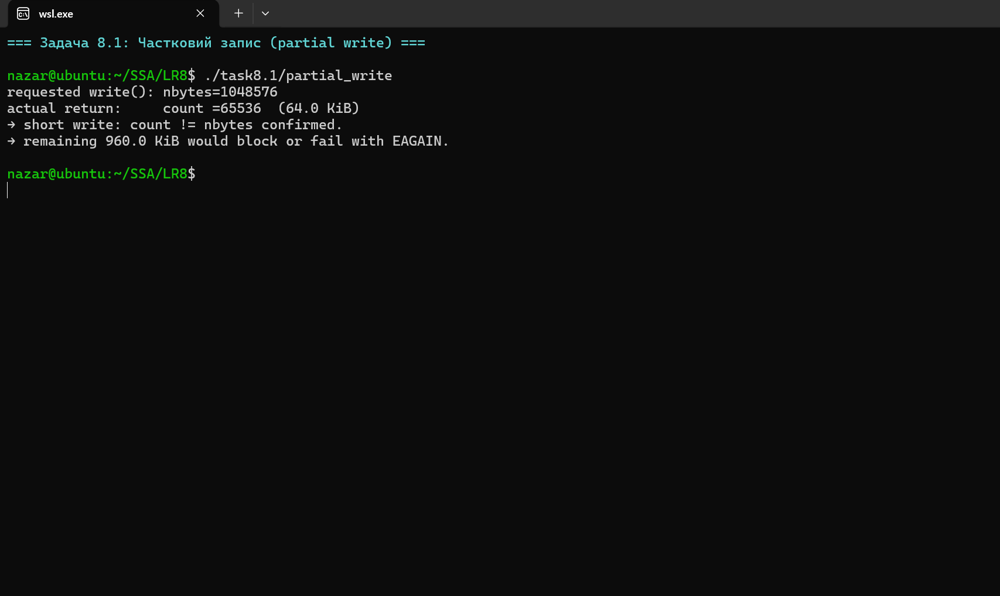
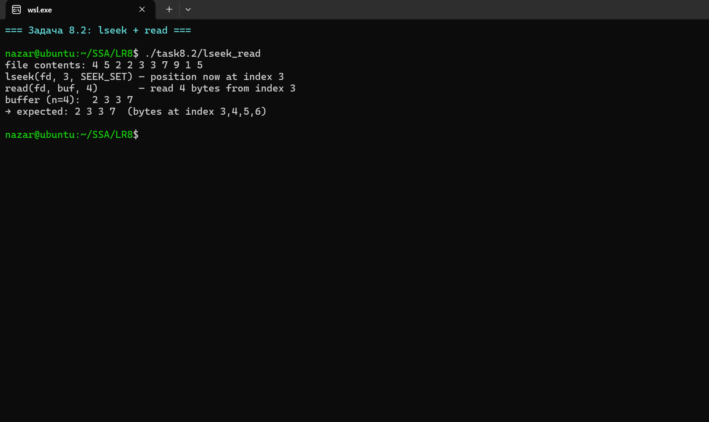
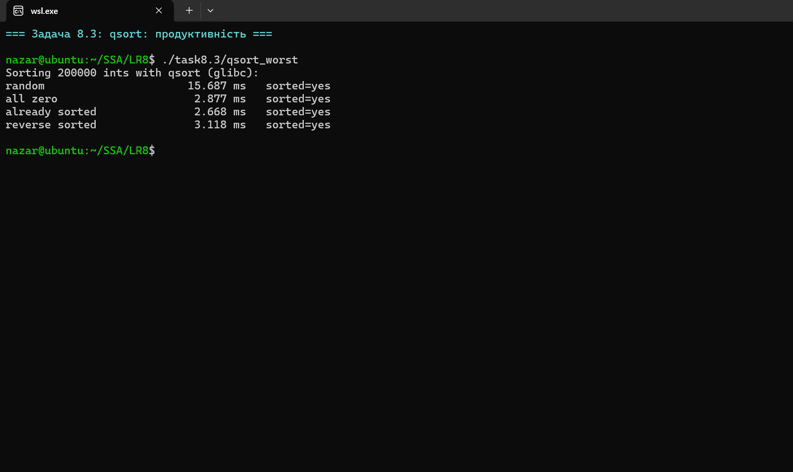
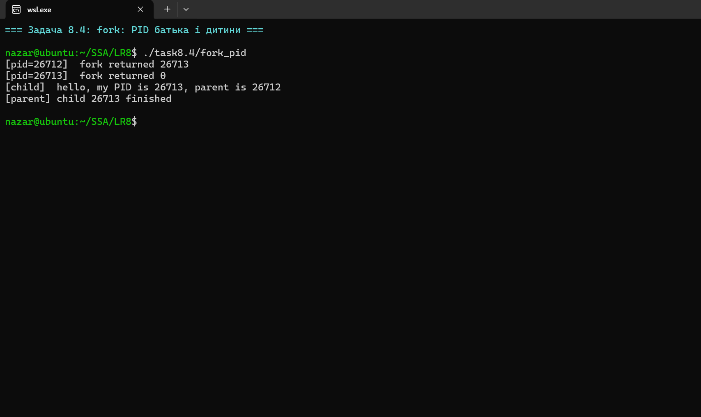
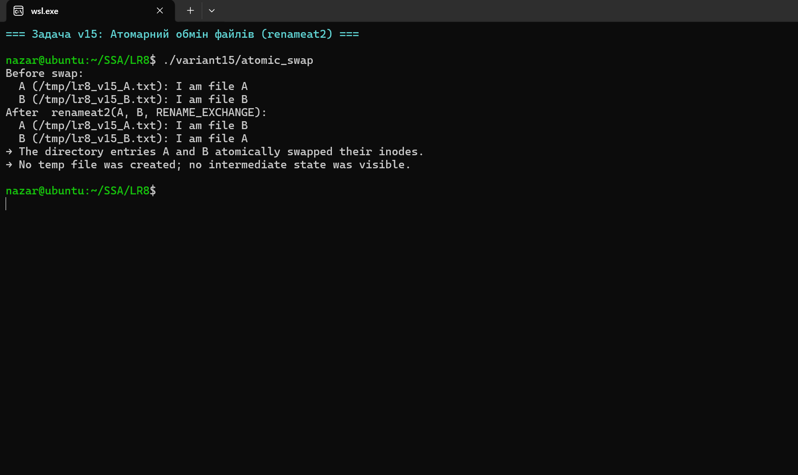

# Лабораторна робота №8

**Студент:** Степаненко Назар Юрійович
**Група:** ТВ-43
**Варіант:** 15

## Тема
Системні виклики в UNIX/POSIX: файлові операції, `fork()`, `qsort()`, `write()`, `read()`, `lseek()`.

## Завдання
Загальні задачі 8.1-8.4 + варіантне завдання №15: атомарний обмін вмістом двох файлів без створення тимчасових файлів.

## Компіляція та запуск
```bash
make all
./task8.1/partial_write
./variant15/atomic_swap
```


## Огляд завдань

### Задача 8.1 — Чи може `write()` повернути менше за `nbytes`?


Файл: [`task8.1/partial_write.c`](task8.1/partial_write.c)

**Відповідь: ТАК, і не рідко.** POSIX гарантує лише, що при успіху `write()` повертає число **записаних** байт (`1..nbytes`), а не обов'язково `nbytes`. Типові причини коротких записів:

| Причина | Коли виникає |
|---|---|
| Pipe-буфер переповнений | Pipe має ємність ~64 KiB на Linux. Спроба write 1 MiB → перші ~65 KiB записані, далі блокування. |
| `RLIMIT_FSIZE` перевищено | SIGXFSZ + короткий запис. |
| `ENOSPC` посеред запису | Диск заповнився під час запису. |
| Сигнал перервав повільний `write` | Якщо хоча б 1 байт уже записано, повертається short count, **не** `-EINTR`. |
| Non-blocking fd | `O_NONBLOCK` → стільки байт, скільки влізло. |
| Сокети | Залежно від `SO_SNDBUF`. |

Демо записує 1 MiB у pipe з `O_NONBLOCK`. Результат: 65536 байт (саме розмір pipe-буфера). Тому **кожен серйозний код на C повинен записувати у циклі** до повного запису:
```c
while (off < total) {
    ssize_t r = write(fd, buf + off, total - off);
    if (r < 0) { if (errno == EINTR) continue; return -1; }
    off += r;
}
```

### Задача 8.2 — `lseek(3, SEEK_SET); read(4)` над `4 5 2 2 3 3 7 9 1 5`


Файл: [`task8.2/lseek_read.c`](task8.2/lseek_read.c)

**Відповідь: буфер міститиме `2 3 3 7`** — байти за індексами 3, 4, 5, 6 (нумерація з нуля).
`lseek(fd, 3, SEEK_SET)` ставить позицію файлу **на байт 3** (тобто перед четвертим за рахунком). Подальший `read(4)` читає з цієї позиції вперед.

Корисний нюанс: `SEEK_SET` — абсолютна позиція; `SEEK_CUR` — від поточної; `SEEK_END` — від кінця. Існує ще `SEEK_HOLE` і `SEEK_DATA` (з Linux 3.1) для роботи зі sparse-файлами.

### Задача 8.3 — Найгірші вхідні дані для `qsort` + тестування коректності


Файл: [`task8.3/qsort_worst.c`](task8.3/qsort_worst.c)

`glibc qsort` — це **не** наївний quicksort. Це гібрид: introsort з median-of-3 pivot + перехід на mergesort, коли глибина рекурсії перевищує ~`2*log2(n)`. Тому класичні «вбивці quicksort» його не вбивають.

Вимірювання на 200000 цілих:
| Вхід | Час | Причина |
|---|---|---|
| Random | ~15 ms | Базовий випадок |
| All zero | ~3 ms | Всі рівні → median-of-3 пивот негайно ділить |
| Sorted | ~3 ms | Pre-sort detection + mergesort |
| Reverse | ~3 ms | Аналогічно |

Сюрприз: відсортовані дані сортуються **швидше**, ніж випадкові. Це через cache locality + early-exit перевірки. Класичний quicksort із вибором першого елементу як pivot мав би тут O(n²).

**Безпечна функція порівняння:**
```c
return (x > y) - (x < y);   /* НЕ "return x - y", це підриває знакові int */
```
`x - y` для `x = INT_MIN, y = 1` дає переповнення → undefined behavior. Це поширена помилка.

### Задача 8.4 — Що друкує `fork()` + `printf("%d", pid)`?


Файл: [`task8.4/fork_pid.c`](task8.4/fork_pid.c)

`fork()` **повертає двічі** на успіху:
- у **батьку** — PID нового процесу,
- у **дитині** — `0`.

Тому `printf` виконається двічі — раз у кожному процесі. Порядок виводу — non-deterministic, залежить від планувальника.

**Підводний камінь — double print:** якщо `printf` зробити **до** `fork`, і stdout буферизований (наприклад, перенаправлений у файл), то буфер успадковується дитиною. Коли обидва процеси завершуються, кожен дренує свій буфер — і ми бачимо **продубльований** вивід. Лікування:
- `setvbuf(stdout, NULL, _IONBF, 0)` — вимкнути буфер.
- Або `fflush(stdout)` перед `fork()`.

### Варіантне завдання 15 — атомарний обмін вмістом двох файлів без temp-файлів


Файл: [`variant15/atomic_swap.c`](variant15/atomic_swap.c)

**Класичний (неатомарний) підхід** з трьома `rename()`:
```
rename(A, tmp);   // 1) A зникає, tmp з'являється
rename(B, A);     // 2) B зникає, A відроджується з вмістом B
rename(tmp, B);   // 3) tmp зникає, B відроджується з вмістом A
```
Проблеми:
- Створюється `tmp` (заборонено).
- Між кроками 1 і 2 спостерігач бачить, що `A` не існує — це порушує інваріант "обидва файли завжди існують".
- Якщо процес впав між кроками — стан непослідовний.

**Розв'язок — Linux 3.15+ `renameat2(RENAME_EXCHANGE)`:**
Єдиний справді атомарний спосіб обміняти два шляхи. Ядро всередині `dcache` міняє місцями `dentry → inode` посилання — інодів не торкає, дані файлів не копіюються. З погляду будь-якого іншого процесу: до syscall обидва файли містять свій вміст, після syscall обидва містять чужий. Проміжного стану не існує.

```c
syscall(SYS_renameat2, AT_FDCWD, "A", AT_FDCWD, "B", RENAME_EXCHANGE);
```

**Альтернативи на інших Unix:** немає. На macOS є `renamex_np` з прапором `RENAME_SWAP` (мак-специфічний). На BSD-сім'ї цього взагалі немає. POSIX до 2024 року не стандартизував.

**Підводні камені:**
- Потрібен Linux 3.15+ (травень 2014). На старіших дистрибутивах `errno=EINVAL`.
- ФС має підтримувати: ext4, btrfs, xfs, tmpfs — так. NFS — залежить від версії. FAT — ні.
- Обидва шляхи мають існувати, інакше `ENOENT`.
- Не можна обміняти каталог із файлом — `EISDIR` чи `ENOTDIR` залежно від напрямку.

## Чому це важливо для системного програмування
Усі чотири загальні задачі демонструють поширені «не очевидні» властивості UNIX-API:
1. `write()` не гарантує повний запис — треба цикл.
2. `lseek()` — це низькорівневий курсор, який нічого не читає.
3. Стандартна бібліотека сильно оптимізує те, що здається «класичним алгоритмом» — не варто переізобретати.
4. `fork()` дублює увесь стан процесу, включно з буферами stdio — це джерело багатьох багів.

Варіантне завдання 15 показує, що навіть базова операція як «обмін двох файлів» вимагає спеціального ядерного механізму, щоб бути атомарною. Це причина, чому базові утиліти типу `git`, `etc-update`, `mv -T` мусять знати про `renameat2`.

## Висновок
Системні виклики на UNIX мають семантику, відмінну від наївних інтуїцій із високорівневих мов. Знання цих деталей — `count != nbytes`, `INT_MIN` overflow в `cmp`, успадкування буферів через `fork`, відсутність атомарності в наївному swap через 3× rename — це і є те, що відрізняє системного програміста від просто програміста.
