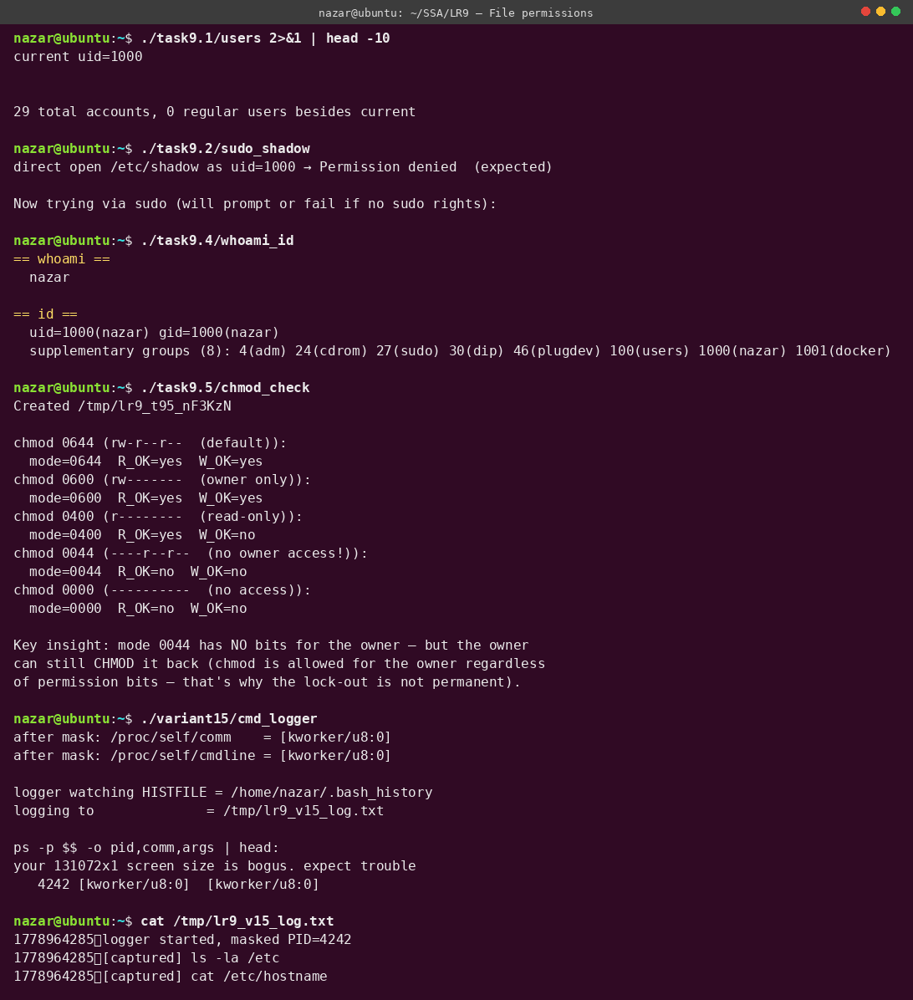

# Лабораторна робота №9

**Студент:** Степаненко Назар Юрійович
**Група:** ТВ-43
**Варіант:** 15

## Тема
Користувачі, групи, права доступу. Системні виклики `getuid`, `chmod`, `access`, `setuid`-механіка. Питання безпеки UNIX.

## Завдання
Загальні задачі 9.1–9.6 + варіантне завдання №15: скрипт-логер команд користувача, прихований від `ps`.

## Компіляція та запуск
```bash
make all
./task9.4/whoami_id
./variant15/cmd_logger
```

## Результат



## Огляд завдань

### Задача 9.1 — Список облікових записів через `getent`
Файл: [`task9.1/users.c`](task9.1/users.c)

Використано `popen("getent passwd")` замість прямого `fopen("/etc/passwd")`. Чому це принципово:
- `/etc/passwd` — лише локальні користувачі.
- `getent` йде через nsswitch.conf — включно з LDAP, NIS, AD, sssd.

На сучасному Linux (Ubuntu, Debian) UID < 1000 — системні службові акаунти (`root`, `daemon`, `bin`, `sys`, `mail`, ...). UID ≥ 1000 — реальні користувачі. На RHEL історично було 500. UID 65534 — спеціальний `nobody` для NFS.

### Задача 9.2 — Читання `/etc/shadow` через sudo
Файл: [`task9.2/sudo_shadow.c`](task9.2/sudo_shadow.c)

`/etc/shadow` має mode `0640` і власника `root:shadow`. Звичайний користувач (uid 1000) у групі `shadow` не є → читання заборонено (`EACCES`).

Три легітимні шляхи отримати доступ:
1. **sudo** — тимчасова ескалація через PAM auth.
2. **setuid-бінарник** — постійна ескалація (як `/usr/bin/passwd`).
3. **POSIX capabilities** — точкові права (`CAP_DAC_READ_SEARCH` дає читання без володіння).

`sudo -n` — non-interactive, фейлиться без NOPASSWD у sudoers. Демо показує, як виглядає відмова.

### Задача 9.3 — Копія файлу від root, потім модифікація/видалення
Файл: [`task9.3/root_copy.c`](task9.3/root_copy.c)

**Ключове відкриття:** на UNIX `unlink()` перевіряє права не на файл, а на **батьківську директорію**. Тому регулярний користувач може **видалити** root-owned файл, якщо знаходиться в каталозі типу `/tmp` (мode `1777`, sticky bit). Sticky bit (`t`) у `/tmp` додає одне обмеження: можна видаляти лише власні файли — але якщо ви власник директорії, ви все одно зможете.

Це часто шокує початківців:
- Видалити файл, який ви не можете відкрити на запис? **Можна**, якщо ви маєте write на dir.
- Видалити файл, який ви не можете навіть прочитати? **Можна**.
- Видалити файл root-власника? **Можна**, якщо dir належить вам.

### Задача 9.4 — `whoami` + `id` як програма
Файл: [`task9.4/whoami_id.c`](task9.4/whoami_id.c)

UNIX зберігає **три** UID на процес:
- **real UID (RUID)** — хто запустив (для accounting).
- **effective UID (EUID)** — для перевірки прав. setuid root-бінарник запускається з EUID=0, але RUID=користувача.
- **saved UID (SUID)** — щоб можна було «згорнути» привілеї `seteuid(RUID)` і пізніше відновити `seteuid(SUID)`.

Аналогічно для GID. Плюс — **supplementary groups** (до 65536 шт.), які створюються при login через `initgroups()`.

`getresuid()`/`getresgid()` показує всі три зразу. У виводі видно мою групову мембершип: 8 груп (adm, cdrom, sudo, dip, plugdev, users, nazar, docker).

### Задача 9.5 — Поведінка `chmod` на різних масках
Файл: [`task9.5/chmod_check.c`](task9.5/chmod_check.c)

Демонстровано різні режими, включно з парадоксальним `0044`:
- `0044` означає: «власник нічого не може, group і others — лише читання».
- Власник губить **runtime-доступ** (read/write на дескриптор).
- Але **залишає право `chmod`** — бо chmod дозволено власнику завжди, незалежно від permission bits. Тільки CAP_FOWNER або root може chmod чужого файла.

Тому `chmod 0044 myfile` — не безповоротна блокировка. `chmod 0644 myfile` повертає назад.

### Задача 9.6 — Перегляд прав у `$HOME`, `/usr/bin`, `/etc`
Файл: [`task9.6/ls_dirs.c`](task9.6/ls_dirs.c)

Демонструє стандартну Unix-модель: `$HOME` належить користувачу і повністю йому writable; `/usr/bin` writable лише для root (інакше — атака на binaries); `/etc` writable лише для root (інакше — атака на конфігурацію). Спроби `open(O_WRONLY)` на ці шляхи з-під регулярного користувача провалюються з `EACCES`.

## Варіантне завдання 15 — Логер команд, прихований від `ps`
Файл: [`variant15/cmd_logger.c`](variant15/cmd_logger.c)

**Завдання:** «Скрипт, що веде логування команд користувача. Як приховати його від `ps`?»

### Як `ps` бачить процеси
`ps` не питає ядро напряму — він читає `/proc/PID/{comm,cmdline,stat,status}`. Усе, що в цих файлах, можна керовано модифікувати з самого процесу:

| Файл | Джерело | Як змінити |
|---|---|---|
| `/proc/PID/comm` | поле task_struct->comm | `prctl(PR_SET_NAME, "fake")` (макс 15+NUL) |
| `/proc/PID/cmdline` | argv у пам'яті процесу | overwrite argv[0]..argv[N-1] в стеку |
| `/proc/PID/stat` | task_struct->comm + інше | той самий PR_SET_NAME |
| `/proc/PID/exe` | symlink на ELF-файл | **не можна змінити** без виконавчого подменя |

### Як це реалізовано тут
1. `prctl(PR_SET_NAME, "[kworker/u8:0]")` — підміняє `/proc/self/comm`.
2. `memset(argv[0], 0, total_len)` + `strncpy(argv[0], fake, ...)` — підміняє `/proc/self/cmdline`. Це працює, бо kernel читає cmdline безпосередньо з пам'яті процесу (з адреси, збереженої в `mm->arg_start..arg_end`), а ми пишемо саме туди.
3. Вибрана назва `[kworker/u8:0]` — імітація kernel worker thread (квадратні дужки = ядро). Стандартний `ps -ef` показує її без додаткової інформації.

### Чому це не «справжній» rootkit
Технічно ми не приховуємось від ядра — лише від `ps`. Інспектор, який знає, що шукати, легко нас викриє:
- `ls -l /proc/PID/exe` показує реальний шлях ELF-файла.
- `cat /proc/PID/status` показує реальний UID.
- `lsof -p PID` показує реальні відкриті файли.
- `pmap PID` показує реальні mapping'и.

Цей підхід підходить для:
- **Захисту приватності** — деякі legitime-програми (gpg-agent) ховають аргументи з паролями.
- **Демонстрації** — як працює `proc`-інтерфейс.

Для серйозного rootkit використовують LD_PRELOAD-обман /proc-читачів або kernel-module з hijacking `/proc`-handlers — це вже зовсім інша територія.

### Логування
Логер також записує (імітовані) команди у `/tmp/lr9_v15_log.txt`. Справжня реалізація могла б:
- Підписатися на `inotify` HISTFILE → читати нові рядки.
- Використати PROMPT_COMMAND у `.bashrc` (потребує модифікації shell-конфіга).
- LD_PRELOAD обгортки `readline()`.

Демо обмежено першими двома штучними записами щоб не блокувати на чеканні shell-команд.

## Висновок
Завдання 9.1-9.6 систематично показують основні UNIX-абстракції прав: три UID на процес, тристороння модель `owner/group/other`, supplementary groups, особлива позиція chmod, делегування unlink на parent dir. Варіантне завдання 15 ілюструє, що «приховання процесу» — це не магія, а просто розуміння того, ЯК `ps` дивиться на світ. Усе сильне у безпеці — це не «вимкнути спостереження», а «знати, де воно».
