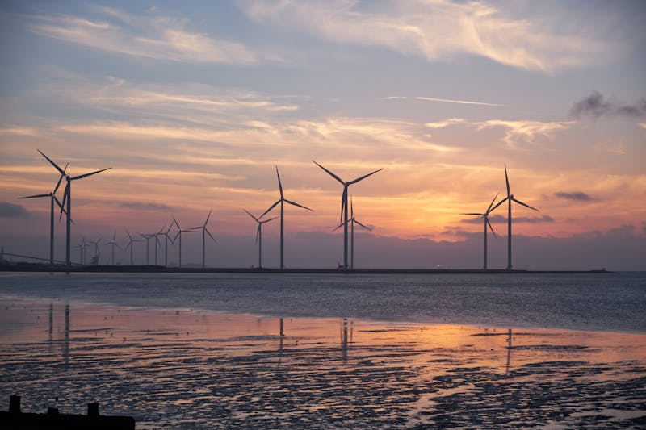

МІНІСТЕРСТВО ОСВІТИ І НАУКИ УКРАЇНИ
НАЦІОНАЛЬНИЙ ТЕХНІЧНИЙ УНІВЕРСИТЕТ УКРАЇНИ
«КИЇВСЬКИЙ ПОЛІТЕХНІЧНИЙ ІНСТИТУТ ІМЕНІ ІГОРЯ СІКОРСЬКОГО»

Факультет теплоенергетичний
Кафедра автоматизації проектування енергетичних процесів і систем

# ЗВІТ

## з практичної роботи №1

### з дисципліни «Основи Веб-програмування»

**Тема:** HTML та CSS. Розробка інформаційного веб-сайту енергетичного об'єкта

**Варіант 15:** Вітрова станція «Приазовська», 150 МВт

Студент групи ТВ-43
<!-- ПІБ: __________________ -->

GitHub: https://github.com/d3Par1/University-Repository/tree/main/Year-2/Semester-2/Web/PR/PR1

Викладач:
<!-- ПІБ викладача: __________________ -->

Київ — 2025

---

## 1. Мета роботи

Спроєктувати та реалізувати HTML-структуру і CSS-стилі односторінкового сайту для інформаційного веб-сайту енергетичного об'єкта з урахуванням вимог до контенту, навігації та дизайну.

**Завдання:**
- Обрати варіант енергетичного об'єкта (Варіант 15 — ВЕС «Приазовська»)
- Зібрати інформацію про об'єкт
- Створити структуру сторінки та розробити ескіз макету
- Підготувати текстовий контент та підібрати зображення
- Створити файлову структуру проєкту
- Написати HTML-код та підключити Bootstrap
- Створити власні CSS-стилі
- Інтегрувати контент та зображення
- Перевірити базову функціональність та адаптивність

---

## 2. Теоретична частина

### 2.1. Основи HTML5

HTML (HyperText Markup Language) — мова розмітки для створення веб-сторінок. HTML5 є п'ятою та актуальною версією стандарту, що додає семантичні теги для кращої структуризації документа.

**Базова структура HTML5-документа:**

```html
<!DOCTYPE html>
<html lang="uk">
<head>
    <meta charset="UTF-8">
    <meta name="viewport" content="width=device-width, initial-scale=1.0">
    <title>Назва сторінки</title>
</head>
<body>
    <!-- Контент -->
</body>
</html>
```

**Семантичні теги HTML5:**
- `<header>` — заголовкова частина сторінки або секції
- `<nav>` — навігаційне меню
- `<main>` — основний контент сторінки
- `<section>` — логічно завершений розділ
- `<footer>` — нижній колонтитул

### 2.2. Основи CSS3

CSS (Cascading Style Sheets) — мова стилів для оформлення HTML-документів. CSS3 додає можливості анімацій, градієнтів, трансформацій та медіа-запитів для адаптивного дизайну.

**Ключові можливості CSS3, використані у проєкті:**
- **CSS-змінні** (`--primary`, `--secondary`) — для централізованого керування кольоровою схемою
- **Flexbox** (`display: flex`) — для гнучкого розташування елементів
- **Градієнти** (`linear-gradient`) — для фону навігації, hero-секції та таблиць
- **Анімації** (`@keyframes fadeInUp`) — для плавної появи секцій
- **Transitions** (`transition: .3s ease`) — для hover-ефектів
- **Media queries** (`@media (max-width: 768px)`) — для адаптивності

### 2.3. Bootstrap 5

Bootstrap — CSS-фреймворк для швидкої розробки адаптивних веб-сайтів. Підключається через CDN:

```html
<link href="https://cdn.jsdelivr.net/npm/bootstrap@5.3.0/dist/css/bootstrap.min.css"
      rel="stylesheet">
```

**Використані компоненти Bootstrap:**
- **Grid system** — `container`, `row`, `col-lg-*`, `col-md-*` для сіткової верстки
- **Navbar** — адаптивна навігаційна панель з burger-меню
- **Cards** — картки для відображення особливостей об'єкта
- **Table** — `table-striped`, `table-hover` для стилізації таблиці параметрів
- **Utilities** — класи для відступів (`mt-4`, `mb-5`, `py-4`), вирівнювання (`text-center`), типографіки (`fw-bold`, `lead`)

### 2.4. Опис об'єкта автоматизації

**Варіант 15 — Вітрова станція «Приазовська»:**
- Тип: Вітрова електростанція
- Потужність: 150 МВт
- Напруга: 0,69/35 кВ
- Місцезнаходження: Запорізька обл.

Вітрова електростанція (ВЕС) — об'єкт відновлюваної енергетики, що перетворює кінетичну енергію вітру в електричну. Станція «Приазовська» розташована у степовій зоні Приазов'я, де середньорічна швидкість вітру становить 7,8 м/с. До складу ВЕС входять 50 турбін Vestas V117-3.45 MW загальною потужністю 150 МВт, що забезпечують річне виробництво ~430 ГВт·год електроенергії.

### 2.5. Перелік вимог до веб-сторінки

1. Валідна HTML5 структура з семантичними тегами
2. Навігаційне меню з посиланнями на розділи: Про об'єкт, Параметри, Схема, Контакти
3. Заголовок h1 з назвою об'єкта та підзаголовок
4. Детальний опис об'єкта (мінімум 2 абзаци)
5. Таблиця технічних параметрів (мінімум 7 рядків)
6. Мінімум 2 зображення з alt-атрибутами
7. Bootstrap для адаптивної сітки та компонентів
8. Власний CSS файл з унікальними стилями та анімаціями
9. Контактна інформація у нижньому колонтитулі
10. Адаптивний дизайн для різних розмірів екранів

### 2.6. Обґрунтування вибраних методів реалізації

Для реалізації обрано комбінацію HTML5 + CSS3 + Bootstrap 5, оскільки:
- HTML5 забезпечує семантичну структуру, що покращує доступність і SEO
- CSS3 дозволяє створити унікальний візуальний стиль з анімаціями та градієнтами
- Bootstrap 5 надає готову адаптивну сітку та компоненти, що пришвидшує розробку та гарантує кросбраузерність

Колірна схема обрана тематично: блакитний (#0d6efd) — небо, темно-зелений (#1a6b5a) — природа, аква (#29d9c2) — чиста енергія. Це відповідає тематиці вітрової енергетики.

---

## 3. Опис реалізації

### 3.1. Заняття 1 (2 години): Проєктування

**Крок 1. Вибір варіанту.**
Обрано варіант 15 — Вітрова станція «Приазовська», 150 МВт, Запорізька обл.

**Крок 2. Аналіз предметної області.**
Проведено аналіз типової структури вітрової електростанції:
- Принцип роботи: перетворення кінетичної енергії вітру в електричну через генератори вітрових турбін
- Основне обладнання: вітрові турбіни Vestas V117 (50 шт.), підвищувальні трансформатори 0,69/35 кВ, кабельна мережа 35 кВ, головна підстанція 35/110 кВ
- Режим роботи: цілодобовий, залежить від вітрових умов; керування через SCADA

**Крок 3. Створення структури HTML-документа.**
Визначено основні розділи сайту:
- Навігаційна панель (navbar)
- Hero-секція з назвою та слоганом
- Смуга статистики (ключові показники)
- Розділ «Про об'єкт» з описом та фото
- Розділ «Особливості та переваги» (картки)
- Розділ «Технічні параметри» (таблиця)
- Розділ «Схема та вигляд» (фото + однолінійна схема)
- Розділ «Контактна інформація» (картки)
- Футер з контактами

**Крок 4. Розробка макету.**
Спроєктовано адаптивний макет з використанням Bootstrap grid:
- Desktop (>992px): двоколонкова верстка для основних секцій (col-lg-7 + col-lg-5)
- Tablet (768–992px): зменшені заголовки та відступи
- Mobile (<768px): одноколонкова верстка, burger-меню

**Крок 5. Підготовка контенту.**
Написано текстовий контент: опис станції (3 абзаци), таблиця параметрів (10 рядків), контактна інформація.

**Крок 6. Підбір зображень.**
Підібрано 3 зображення:
- `wpp-general.jpg` — загальний вигляд ВЕС (фото турбін біля Азовського узбережжя)
- `wpp-layout.jpg` — розташування турбін у степовій зоні
- `wpp-scheme.svg` — однолінійна електрична схема (створена у форматі SVG)

### 3.2. Заняття 2 (2 години): Реалізація

**Крок 1. Створення файлової структури проєкту.**

```
PR1/
├── index.html          — головна сторінка
├── styles.css          — власні CSS-стилі
├── images/
│   ├── wpp-general.jpg — загальний вигляд ВЕС
│   ├── wpp-layout.jpg  — розташування турбін
│   └── wpp-scheme.svg  — однолінійна електрична схема
└── README.md           — опис проєкту
```

**Крок 2. Написання HTML-коду.**

Створено файл `index.html` з валідною HTML5-структурою:

- Оголошення `<!DOCTYPE html>` та `<html lang="uk">`
- Мета-теги: `charset="UTF-8"`, `viewport` для адаптивності
- Підключення Bootstrap 5.3.0 через CDN
- Підключення власного файлу стилів `styles.css`
- Семантичні теги: `<nav>`, `<header>`, `<main>`, `<section>` (5 секцій), `<footer>`

Реалізовані компоненти:
- **Navbar** — адаптивне навігаційне меню з 4 пунктами (Про об'єкт, Параметри, Схема, Контакти), burger-меню на мобільних, логотип «ВітроПортал»
- **Hero section** — заголовок h1 з назвою ВЕС, підзаголовок з lead-класом, кнопки навігації, декоративні CSS-силуети турбін
- **Stats bar** — 4 ключові показники у Bootstrap-сітці (col-6 col-md-3)
- **About section** — 3 абзаци опису + зображення загального вигляду (col-lg-7 + col-lg-5)
- **Features section** — 3 Bootstrap-картки (col-md-4) з особливостями
- **Parameters section** — таблиця з 10 рядками, Bootstrap-класи `table-striped table-hover`
- **Scheme section** — фото розташування + список структури + SVG однолінійна схема
- **Contacts section** — 2 картки (col-md-6) з реквізитами та контактами
- **Footer** — 3-колонковий Bootstrap-ряд з контактами

**Крок 3. Підключення Bootstrap.**

Bootstrap 5.3.0 підключено через CDN:
- CSS: `https://cdn.jsdelivr.net/npm/bootstrap@5.3.0/dist/css/bootstrap.min.css`
- JS: `https://cdn.jsdelivr.net/npm/bootstrap@5.3.0/dist/js/bootstrap.bundle.min.js`

**Крок 4. Створення власних CSS-стилів.**

Файл `styles.css` (372 рядки) містить:

- **CSS-змінні** (`:root`) — 11 змінних для кольорів, тіней, радіусів, переходів
- **Навігація** — градієнтний фон, анімація підкреслення при hover, трансформація при наведенні
- **Hero-секція** — 3-кольоровий градієнт, декоративні силуети турбін через CSS pseudo-елементи, backdrop-filter для мітки варіанту
- **Кнопка `.btn-wind`** — градієнтний фон з hover-ефектом підйому та тіні
- **Смуга статистики** — стилізація чисел, одиниць та підписів
- **Заголовки секцій** — кольорове підкреслення accent-кольором
- **Картки** — видалення border, тінь, hover-ефект підйому на -6px
- **Таблиця** — градієнтний заголовок, hover-підсвітка рядків
- **Зображення** — hover-ефект збільшення (scale 1.03)
- **Схема-список** — кастомні кольорові точки, розділювачі
- **Футер** — градієнтний фон відповідний hero-секції
- **Анімації** — `fadeInUp` для секцій з різними `animation-delay`
- **Медіа-запити** — 3 точки переходу: 992px, 768px, 576px

**Крок 5. Інтеграція контенту та зображень.**

Додано 3 зображення:
1. `wpp-general.jpg` (53 КБ) — фото вітрових турбін біля Азовського узбережжя на заході сонця. Використано у секції «Про об'єкт» як загальний вигляд (Рис. 1)
2. `wpp-layout.jpg` (18 КБ) — фото турбін у степовому полі вранішньому тумані. Використано у секції «Схема» для відображення розташування (Рис. 2)
3. `wpp-scheme.svg` — однолінійна електрична схема ВЕС, створена у форматі SVG. Відображає ланцюг: Турбіни → Генератор 0,69 кВ → Трансформатор 0,69/35 кВ → Кабельна мережа 35 кВ → ПС «Приазовська-35» → Шина 110 кВ → ОЕС України (Рис. 3)

Усі зображення мають alt-атрибути українською мовою та клас `img-fluid` для адаптивності.

### 3.3. Заняття 3 (2 години): Тестування та звітність

**Крок 1. Перевірка базової функціональності.**
- Навігаційне меню: всі 4 посилання (#about, #params, #scheme, #contacts) працюють коректно
- Плавна прокрутка до розділів через CSS `scroll-behavior: smooth`
- Bootstrap collapse: burger-меню на мобільних відкривається/закривається

**Крок 2. Тестування адаптивності.**

Сайт перевірено на 3 розмірах екрана:
- **Desktop** (1920px) — двоколонкова верстка, повне навігаційне меню
- **Tablet** (768px) — зменшені заголовки, двоколонкова сітка зберігається
- **Mobile** (375px) — одноколонкова верстка, burger-меню, декоративні елементи приховані

**Крок 3. Оформлення звіту.**

Підготовлено звіт з усіма необхідними розділами.

---

## 4. Тестування

### 4.1. Перевірка відповідності вимогам

| Вимога | Результат |
|---|---|
| Валідна HTML5 структура | Виконано: DOCTYPE, lang, charset, viewport |
| Семантичні теги | Виконано: nav, header, main, section (5), footer |
| Навігаційне меню | Виконано: 4 пункти, responsive, burger-меню |
| Заголовок h1 з назвою | Виконано: «Вітрова станція «Приазовська»» |
| Опис об'єкта (мін. 2 абзаци) | Виконано: 3 абзаци |
| Таблиця параметрів (мін. 7 рядків) | Виконано: 10 рядків |
| Зображення з alt (мін. 2) | Виконано: 3 зображення з alt |
| Bootstrap сітка та компоненти | Виконано: navbar, grid, cards, table, utilities |
| Власний CSS файл | Виконано: styles.css (372 рядки) |
| Адаптивний дизайн | Виконано: 3 media queries |
| Кольорова схема | Виконано: блакитний + зелений + аква |
| Футер з контактами | Виконано: адреса, телефон, email |

### 4.2. Тестування на різних пристроях

**Desktop (1920x1080):**
- Навігаційне меню відображається горизонтально
- Контент розташований у двох колонках (col-lg-7 + col-lg-5)
- Картки особливостей у 3 колонки (col-md-4)
- Таблиця відображається повністю

**Tablet (768x1024):**
- Навігаційне меню зберігається горизонтальним (navbar-expand-lg)
- Заголовок зменшений до 1.75rem
- Картки переходять у 2+1 розташування

**Mobile (375x667):**
- Burger-меню замінює горизонтальну навігацію
- Контент відображається в одну колонку
- Декоративні силуети турбін приховані
- Кнопки зменшені для зручності натискання

---

## 5. Результати роботи

В результаті виконання практичної роботи №1 було створено односторінковий інформаційний веб-сайт вітрової електростанції «Приазовська» (Варіант 15).

**Реалізований функціонал:**
- Адаптивна навігаційна панель з 4 розділами та плавною прокруткою
- Hero-секція з градієнтним фоном та декоративними CSS-елементами
- Інформаційна смуга з 4 ключовими показниками станції
- Розділ «Про об'єкт» з детальним описом (3 абзаци) та фото загального вигляду
- Розділ «Особливості» з 3 Bootstrap-картками
- Таблиця технічних параметрів з 10 рядками та hover-ефектами
- Розділ «Схема» з фото розташування турбін та SVG однолінійною електричною схемою
- Контактна секція з реквізитами та засобами зв'язку
- Інформативний футер з контактами

**Файлова структура:**
- `index.html` — 355 рядків
- `styles.css` — 372 рядки
- 3 зображення (2 JPG + 1 SVG)
- `README.md` — опис проєкту

**Проєкт розміщено у GitHub-репозиторії:**
https://github.com/d3Par1/University-Repository/tree/main/Year-2/Semester-2/Web/PR/PR1

---

## 6. Висновки

У ході виконання практичної роботи №1 було спроєктовано, реалізовано та протестовано інформаційний веб-сайт енергетичного об'єкта — вітрової електростанції «Приазовська» (Варіант 15, 150 МВт, Запорізька обл.).

**Отримані навички:**
- Створення валідної HTML5-структури з використанням семантичних тегів
- Розробка власних CSS-стилів: CSS-змінні, градієнти, анімації, переходи, hover-ефекти
- Використання фреймворку Bootstrap 5: сіткова система, навігація, картки, таблиці, утиліти
- Створення адаптивного дизайну за допомогою медіа-запитів та Bootstrap breakpoints
- Підбір тематичної кольорової схеми та типографіки
- Створення SVG-діаграм (однолінійна електрична схема)
- Організація файлової структури веб-проєкту

**Що було реалізовано:**
Повнофункціональний односторінковий сайт, що відповідає усім обов'язковим вимогам завдання: семантична HTML5-структура, адаптивна навігація, детальний опис об'єкта, таблиця з 10 технічними параметрами, 3 зображення з alt-атрибутами, Bootstrap-компоненти, власні CSS-стилі з анімаціями, адаптивний дизайн для desktop/tablet/mobile, контактна інформація у футері.

---

## 7. Список використаних джерел

1. Head First HTML and CSS: A Learner's Guide to Creating Standards-Based Web Pages. O'Reilly Media. 2022. — 762 p.
2. HTML, CSS, and JavaScript All in One: Covering HTML5, CSS3, and ES6, Sams Teach Yourself. Sams Publishing. 2021. — 800 p.
3. Bootstrap документація [Електронний ресурс]. — Режим доступу: https://getbootstrap.com
4. MDN Web Docs — HTML та CSS довідник [Електронний ресурс]. — Режим доступу: https://developer.mozilla.org/en-US/
5. W3Schools Online Web Tutorials [Електронний ресурс]. — Режим доступу: https://www.w3schools.com/
6. Google Fonts — безкоштовні шрифти [Електронний ресурс]. — Режим доступу: https://fonts.google.com/
7. Coolors.co — підбір кольорових схем [Електронний ресурс]. — Режим доступу: https://coolors.co

---

## Додатки

### Додаток А. Повний код index.html

```html
<!DOCTYPE html>
<html lang="uk">
<head>
    <meta charset="UTF-8">
    <meta name="viewport" content="width=device-width, initial-scale=1.0">
    <title>Вітрова станція «Приазовська» — 150 МВт</title>
    <link href="https://cdn.jsdelivr.net/npm/bootstrap@5.3.0/dist/css/bootstrap.min.css" rel="stylesheet">
    <link rel="stylesheet" href="styles.css">
</head>
<body>

    <!-- Навігація -->
    <nav class="navbar navbar-expand-lg navbar-dark">
        <div class="container">
            <a class="navbar-brand" href="#">💨 ВітроПортал</a>
            <button class="navbar-toggler" type="button" data-bs-toggle="collapse" data-bs-target="#navbarNav"
                aria-controls="navbarNav" aria-expanded="false" aria-label="Toggle navigation">
                <span class="navbar-toggler-icon"></span>
            </button>
            <div class="collapse navbar-collapse" id="navbarNav">
                <ul class="navbar-nav ms-auto">
                    <li class="nav-item"><a class="nav-link active" href="#about">Про об'єкт</a></li>
                    <li class="nav-item"><a class="nav-link" href="#params">Параметри</a></li>
                    <li class="nav-item"><a class="nav-link" href="#scheme">Схема</a></li>
                    <li class="nav-item"><a class="nav-link" href="#contacts">Контакти</a></li>
                </ul>
            </div>
        </div>
    </nav>

    <!-- Головний заголовок -->
    <header class="hero-section text-white text-center">
        <div class="hero-content">
            <div class="container">
                <p class="hero-label">Варіант 15 — Вітрова електростанція</p>
                <h1 class="display-3 fw-bold">Вітрова станція «Приазовська»</h1>
                <p class="lead fs-4">Чиста енергія Азовського вітру · 150 МВт · Запорізька обл.</p>
                <div class="mt-4">
                    <a href="#about" class="btn btn-outline-light btn-lg me-2">Дізнатись більше</a>
                    <a href="#params" class="btn btn-wind btn-lg">Технічні параметри</a>
                </div>
            </div>
        </div>
        <div class="turbine-silhouette" aria-hidden="true">
            <div class="turbine" id="t1"></div>
            <div class="turbine" id="t2"></div>
            <div class="turbine" id="t3"></div>
        </div>
    </header>

    <!-- Статистика -->
    <section class="stats-bar py-4">
        <div class="container">
            <div class="row text-center g-3">
                <div class="col-6 col-md-3">
                    <div class="stat-item">
                        <span class="stat-number">150</span>
                        <span class="stat-unit">МВт</span>
                        <p class="stat-label">Встановлена потужність</p>
                    </div>
                </div>
                <div class="col-6 col-md-3">
                    <div class="stat-item">
                        <span class="stat-number">50</span>
                        <span class="stat-unit">шт</span>
                        <p class="stat-label">Вітрових турбін</p>
                    </div>
                </div>
                <div class="col-6 col-md-3">
                    <div class="stat-item">
                        <span class="stat-number">430</span>
                        <span class="stat-unit">ГВт·год</span>
                        <p class="stat-label">Річне виробництво</p>
                    </div>
                </div>
                <div class="col-6 col-md-3">
                    <div class="stat-item">
                        <span class="stat-number">2019</span>
                        <span class="stat-unit">рік</span>
                        <p class="stat-label">Рік введення в роботу</p>
                    </div>
                </div>
            </div>
        </div>
    </section>

    <!-- Основний контент -->
    <main class="container my-5">

        <!-- Про об'єкт -->
        <section id="about" class="mb-5">
            <div class="row align-items-center">
                <div class="col-lg-7">
                    <h2 class="section-title mb-4">Про об'єкт</h2>
                    <p>
                        Вітрова електростанція «Приазовська» — один із найбільших вітроенергетичних об'єктів
                        Запорізької області, розташований у степовій зоні поблизу Азовського узбережжя.
                        Проєкт реалізовано у 2018–2019 роках у рамках державної програми розвитку відновлюваної
                        енергетики України. Станція введена в промислову експлуатацію у квітні 2019 року та
                        генерує електроенергію для близько 120 000 домогосподарств регіону. Завдяки стабільним
                        вітрам Приазов'я (середня швидкість 7,8 м/с) об'єкт демонструє коефіцієнт використання
                        встановленої потужності понад 30%.
                    </p>
                    <p>
                        До складу станції входять 50 вітрових турбін потужністю 3 МВт кожна виробництва
                        компанії Vestas (модель V117-3.45 MW), встановлених на сталевих конічних вежах
                        висотою 91,5 м. Загальна площа розміщення об'єкта становить близько 4 800 га, проте
                        земля між турбінами використовується у сільськогосподарських цілях. Весь виробляємий
                        струм (0,69 кВ) підвищується трансформаторами до 35 кВ і передається до
                        вузлової підстанції «Приазовська-35» для подальшого розподілу в енергосистемі.
                    </p>
                    <p>
                        Станція щорічно запобігає викиду понад 370 000 тонн CO₂ в атмосферу порівняно з
                        виробництвом еквівалентної кількості електроенергії на теплових електростанціях.
                        Об'єкт обладнано сучасною системою SCADA-моніторингу, що забезпечує цілодобовий
                        дистанційний контроль кожної вітрової турбіни та автоматичне реагування на зміни
                        погодних умов.
                    </p>
                </div>
                <div class="col-lg-5 mt-4 mt-lg-0">
                    
                    <p class="text-muted small text-center mt-2">Рис. 1. Загальний вигляд ВЕС «Приазовська»</p>
                </div>
            </div>
        </section>

        <!-- Особливості -->
        <section class="mb-5">
            <h2 class="section-title mb-4">Особливості та переваги</h2>
            <div class="row g-4">
                <div class="col-md-4">
                    <div class="card feature-card h-100">
                        <div class="card-body text-center p-4">
                            <div class="feature-icon mb-3">🌿</div>
                            <h5 class="card-title">Екологічність</h5>
                            <p class="card-text">Нульові викиди CO₂ під час роботи. Щорічна економія
                                370 000 т парникових газів. Повна відповідність нормам ЄС.</p>
                        </div>
                    </div>
                </div>
                <div class="col-md-4">
                    <div class="card feature-card h-100">
                        <div class="card-body text-center p-4">
                            <div class="feature-icon mb-3">⚡</div>
                            <h5 class="card-title">Надійність</h5>
                            <p class="card-text">Коефіцієнт готовності турбін — 97,5%. Резервне
                                живлення систем управління. Захист від блискавки та обмерзання.</p>
                        </div>
                    </div>
                </div>
                <div class="col-md-4">
                    <div class="card feature-card h-100">
                        <div class="card-body text-center p-4">
                            <div class="feature-icon mb-3">🖥️</div>
                            <h5 class="card-title">Автоматизація</h5>
                            <p class="card-text">Система SCADA з моніторингом у режимі реального часу.
                                Предиктивне технічне обслуговування на основі даних датчиків.</p>
                        </div>
                    </div>
                </div>
            </div>
        </section>

        <!-- Технічні параметри -->
        <section id="params" class="mb-5">
            <h2 class="section-title mb-4">Технічні параметри</h2>
            <div class="table-responsive">
                <table class="table table-striped table-hover align-middle">
                    <thead>
                        <tr>
                            <th scope="col">#</th>
                            <th scope="col">Параметр</th>
                            <th scope="col">Значення</th>
                            <th scope="col">Одиниці виміру</th>
                        </tr>
                    </thead>
                    <tbody>
                        <tr><td>1</td><td>Встановлена потужність</td><td><strong>150</strong></td><td>МВт</td></tr>
                        <tr><td>2</td><td>Напруга генератора (НН)</td><td>0,69</td><td>кВ</td></tr>
                        <tr><td>3</td><td>Напруга мережі (ВН)</td><td>35</td><td>кВ</td></tr>
                        <tr><td>4</td><td>Кількість вітрових турбін</td><td>50</td><td>шт</td></tr>
                        <tr><td>5</td><td>Потужність однієї турбіни</td><td>3,0</td><td>МВт</td></tr>
                        <tr><td>6</td><td>Висота вежі</td><td>91,5</td><td>м</td></tr>
                        <tr><td>7</td><td>Діаметр ротора</td><td>117</td><td>м</td></tr>
                        <tr><td>8</td><td>Розрахункова швидкість вітру</td><td>7,8</td><td>м/с</td></tr>
                        <tr><td>9</td><td>Річне виробництво електроенергії</td><td>430 000</td><td>МВт·год</td></tr>
                        <tr><td>10</td><td>Рік введення в експлуатацію</td><td>2019</td><td>рік</td></tr>
                    </tbody>
                </table>
            </div>
        </section>

        <!-- Схема -->
        <section id="scheme" class="mb-5">...</section>

        <!-- Контакти -->
        <section id="contacts" class="mb-5">...</section>

    </main>

    <!-- Нижній колонтитул -->
    <footer class="footer-section text-white">...</footer>

    <script src="https://cdn.jsdelivr.net/npm/bootstrap@5.3.0/dist/js/bootstrap.bundle.min.js"></script>
</body>
</html>
```

*Примітка: секції Схема, Контакти та Footer скорочені для зменшення обсягу додатка. Повний код доступний у GitHub-репозиторії.*

### Додаток Б. Повний код styles.css

```css
/* ---- CSS-змінні кольорової схеми (вітрова тематика: небо + зелень) ---- */
:root {
    --primary:      #0d6efd;
    --primary-dark: #0a58ca;
    --secondary:    #1a6b5a;
    --accent:       #29d9c2;
    --text-dark:    #1e2d3d;
    --text-muted:   #6c757d;
    --bg-light:     #f0f7ff;
    --shadow-sm:    0 2px 8px rgba(13,110,253,.12);
    --shadow-md:    0 6px 20px rgba(13,110,253,.18);
    --shadow-lg:    0 12px 40px rgba(13,110,253,.22);
    --radius:       12px;
    --transition:   .3s ease;
}

/* ---- Загальне ---- */
*, *::before, *::after { box-sizing: border-box; }
html { scroll-behavior: smooth; }
body {
    font-family: 'Segoe UI', Tahoma, Geneva, Verdana, sans-serif;
    line-height: 1.7;
    color: var(--text-dark);
    background-color: #fff;
}

/* ---- Навігація ---- */
.navbar {
    background: linear-gradient(135deg, var(--primary-dark) 0%, var(--secondary) 100%);
    box-shadow: 0 2px 10px rgba(0,0,0,.2);
    padding: .75rem 1rem;
}
.navbar-brand { font-weight: 700; font-size: 1.4rem; letter-spacing: .5px; }
.nav-link { font-weight: 500; margin: 0 6px; transition: color var(--transition), transform var(--transition); position: relative; }
.nav-link::after { content: ''; position: absolute; bottom: -2px; left: 0; width: 0; height: 2px; background: var(--accent); transition: width var(--transition); }
.nav-link:hover::after, .nav-link.active::after { width: 100%; }
.nav-link:hover { color: var(--accent) !important; transform: translateY(-1px); }

/* ---- Hero секція ---- */
.hero-section { position: relative; min-height: 480px; background: linear-gradient(160deg, #0a1628 0%, #0d3b6e 45%, var(--secondary) 100%); display: flex; flex-direction: column; justify-content: center; overflow: hidden; }
.hero-content { position: relative; z-index: 2; padding: 80px 0 60px; }
.hero-label { display: inline-block; background: rgba(255,255,255,.15); border: 1px solid rgba(255,255,255,.3); border-radius: 999px; padding: .25rem 1rem; font-size: .9rem; letter-spacing: 1px; margin-bottom: 1rem; backdrop-filter: blur(4px); }
.hero-section h1 { text-shadow: 2px 3px 8px rgba(0,0,0,.4); margin-bottom: 1rem; }
.hero-section .lead { opacity: .9; text-shadow: 1px 1px 4px rgba(0,0,0,.3); }
.btn-wind { background: linear-gradient(135deg, var(--accent) 0%, #1aad9a 100%); color: #fff; border: none; font-weight: 600; transition: box-shadow var(--transition), transform var(--transition); }
.btn-wind:hover { color: #fff; transform: translateY(-2px); box-shadow: 0 6px 18px rgba(41,217,194,.45); }

/* ---- Анімації ---- */
@keyframes fadeInUp { from { opacity: 0; transform: translateY(30px); } to { opacity: 1; transform: translateY(0); } }
section { animation: fadeInUp .65s ease-out both; }
#about { animation-delay: .05s; }
#params { animation-delay: .15s; }
#scheme { animation-delay: .25s; }
#contacts { animation-delay: .35s; }

/* ---- Адаптивність ---- */
@media (max-width: 992px) { .hero-section h1 { font-size: 2.2rem; } }
@media (max-width: 768px) { .hero-content { padding: 60px 0 40px; } .hero-section h1 { font-size: 1.75rem; } .stat-number { font-size: 1.6rem; } .section-title { font-size: 1.35rem; } .turbine-silhouette { display: none; } }
@media (max-width: 576px) { .hero-section .lead { font-size: 1rem; } .btn-lg { padding: .5rem 1.1rem; font-size: .95rem; } }
```

*Примітка: стилі скорочені для зменшення обсягу додатка. Повний файл (372 рядки) доступний у GitHub-репозиторії.*
